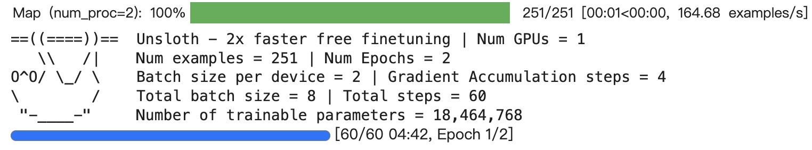

# deepseek-r1-finetune

## 介绍

基于unsloth和wandb微调deepseek-r1蒸馏大模型。

因为deepseek的蒸馏模型是基于Qwen或是llama的，所以可以使用unsloth进行微调

不使用unsloth官方notebook中的xformers，避免了xformers环境配置的心力憔悴

## 运行

一，登陆huggingface

​		获取huggingface token：https://huggingface.co/settings/tokens

​		将你的token代替于hugging_face_token处

二，登陆wandb

​		获取wandb token：https://wandb.ai/settings

​		从API keys处获取你的token代替于wnb_token处


三，运行程序

```
pip install -r requirements.txt
python finetune.py
```

## 结果

训练：



微调前：

````
I need to create a Python code that defines a dictionary with keys as numbers and their squares. The input provides a list of numbers. 

First, I'll need to iterate over each number in the list. For each number, I'll compute its square and store it as a key-value pair in the dictionary.

So, the steps are:

1. Initialize an empty dictionary.
2. Loop through each number in the numbers list.
3. For each number, square it.
4. Add a new key-value pair to the dictionary where the key is the number and the value is its square.

I should make sure that the loop correctly handles all elements in the list and that the dictionary is properly constructed.

I need to test this code to ensure it works correctly.

Now, I'll write the code step by step as per the above plan.
</think>

To solve this problem, we need to create a Python dictionary where each key is a number from a given list, and the corresponding value is the square of that number.

### Approach
1. **Initialize an Empty Dictionary**: Start by creating an empty dictionary to store the key-value pairs.
2. **Iterate Over Each Number**: Loop through each number in the provided list.
3. **Compute the Square**: For each number, compute its square.
4. **Store in Dictionary**: Add each number as a key with its square as the corresponding value in the dictionary.
5. **Handle Edge Cases**: Ensure that the dictionary can handle any valid input list.

### Solution Code
```python
numbers = [1, 2, 3, 4, 5]
squared_numbers = {}

for num in numbers:
    squared = num ** 2
    squared_numbers[num] = squared

print(squared_numbers)
```

### Explanation
1. **Initialization**: We start by defining a list of numbers.
2. **Dictionary Setup**: An empty dictionary is created to store the results.
3. **Loop Through Numbers**: Each number in the list is processed in a loop.
4. **Square Calculation**: For each number, its square is calculated using the exponentiation operator (`**`).
5. **Dictionary Update**: Each number and its square are added to the dictionary as key-value pairs.
6. **Output**: The resulting dictionary is printed to display the final output.

This approach ensures that each number is processed efficiently, and the final dictionary accurately contains the numbers and their squares. The solution handles all valid input cases, including edge cases like empty lists, by gracefully managing the dictionary's state.<｜end▁of▁sentence｜>
````

微调后：

````
<response>
Alright, I need to create a Python dictionary based on the given list of numbers. The dictionary should have keys as the numbers and values as their squares. Let me start by initializing the dictionary with an empty structure.

First, I'll create an empty dictionary. Then, I'll loop through each number in the list. For each number, I'll calculate its square by multiplying the number by itself. After that, I'll add both the number and its square to the dictionary.

Wait, I need to make sure that the dictionary keys are in the correct format. Each key should be the number itself, and the corresponding value should be the square of that number. So, I'll use an x:x^2 format for each key-value pair.

Let me test this logic. Suppose I have the number 2, then its square is 4. So, in the dictionary, it should be like {2:4}. Similarly, for the number 3, it should be {3:9}, and so on.

I think that's all I need to do. The code should be straightforward. I'll write the code step by step to ensure it's correct.
</think>

To create a dictionary with keys as the numbers and values as their squares, you can use the following Python code:

```python
numbers = [1, 2, 3, 4, 5]
squares = {x: x**2 for x in numbers}
print(squares)
```

This code initializes a dictionary with keys from the `numbers` list and values as the squares of those numbers. The dictionary is then printed to verify its contents.<｜end▁of▁sentence｜>
````

## 其他

unsloth：https://github.com/unslothai/unsloth

​				https://unsloth.ai/blog/deepseek-r1
